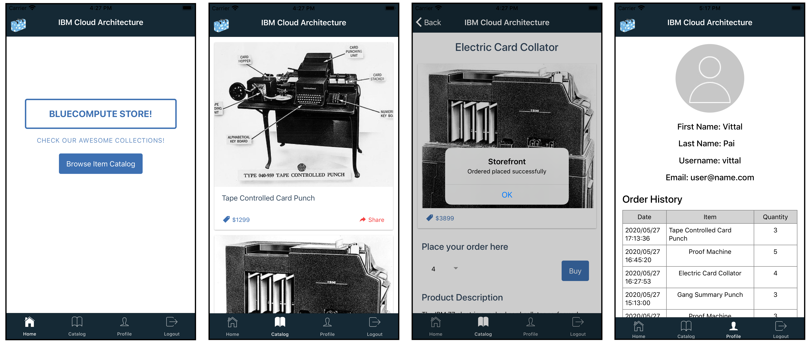
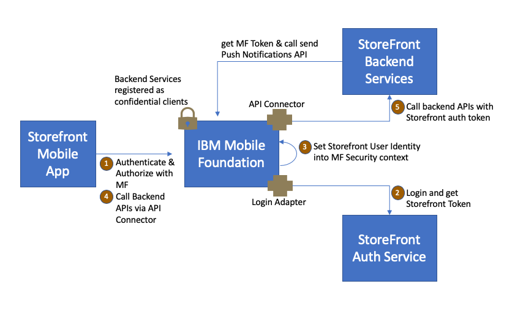

Storefront Ionic Mobile Application
===
## Overview
This is a IBM Mobile Foundation based Ionic Mobile Application frontend to the storefront application.  The application allows mobile app users to browse the storefront catalog items, make an order and review profile.



## Component Interaction Design
IBM Mobile Foundation is positioned as the mobile gateway to the StoreFront providing mobile app and device security over and above the Storefront user authentication and authorization.  All calls to from the mobile app to the Storefront backend services are made via Mobile Foundation to exploit this comprehensive security. The Storefront backend services are registered with Mobile Foundation as confidential clients with appropriate allowed scopes to enable them to invoke the Send Push Notifications API.



### Pre-requisites
- Ionic CLI Version 5.4.16 - https://ionicframework.com/docs/cli
- Storefront server components installed and running - microservices, dependent DBs, IBM Mobile Foundation
- IBM Mobile Foundation CLI - https://www.npmjs.com/package/mfpdev-cli

### Usage
1. Clone this repo locally and change current working directory to storefront-mobile-ionic
```
git clone git@github.com:ibm-garage-ref-storefront/storefront-mobile.git
cd storefront-mobile
```
2. Ensure that all Storefront microservices - catalog, auth, customer, orders and IBM Mobile Foundation services are deployed and running.  
  - To setup and run the storefront microservices refer to the approprite repos under [ibm-garage-ref-storefront](https://github.com/ibm-garage-ref-storefront)
  - IBM Mobile Foundation can be installed as follows:-
    - If you have purchased IBM CloudPak for Applications then IBM Mobile Foundation comes as part of that pack and can be installed as detailed [here](https://www.ibm.com/support/knowledgecenter/en/SSCSJL_4.1.x/install-mf-cli.html)
    - Alternatively, for trial and development purposes you can setup the community edition of IBM Mobile Foundation on a OpenShift cluster run the following commands
     ```
     oc login <openshift login server url and credentials>
     oc project <store front project in which the other storefront microservices have been deployed>
     oc c apply --recursive --filename mobilefoundation
     ```
     Verify if Mobile Foundation is up and running and expose it's service route to be used by the mobile client application
     ```
     oc get pods
     NAME                                               READY   STATUS      RESTARTS   AGE
     storefront-mf-5cdb7b89fc-fthrw                     1/1     Running     0          150m
    
     oc expose svc storefront-mf
     ```
3. Configure Mobile Foundation services for this storefront application as follows: -
    - This StoreFront Mobile Application is designed to receive Push Notifications about the progress of StoreFront order shippments. To enable Mobile Foundation Push Notifications service for this application you must configure the service for Push Notification Credentials (FCM, APNS).  Edit `mfpconfig/app_config.json` file and update it for these credentials under json object `services.push.settings`.  To know more about what these settings and credentials are about lookup https://mobilefirstplatform.ibmcloud.com/tutorials/en/foundation/8.0/notifications/sending-notifications/#setting-up-notifications 
    - Edit `mfpconfig/app_config.json` file and update the json object for the key `adapters` with the endpoint url of storefront auth service, clientId and secret
    - Edit `mfpconfig/app_config.json` file and update the json object for the key `backendservices` with the appropriate endpoint urls of the storefront backend services
    - All other required configurations are already preset into `mfpconfig/app_config.json` file
    - To enable push notification on Android remember to replace `google-services.json` into the directory `ionic` 
    - Edit `mfpconfig/server_config.json` and input the endpoint url, port and admin credentials for the Mobile Foundation Server
    - Save `mfpconfig/server_config.json` and `mfpconfig/app_config.json` files
    - From the root of this repo clone i.e. from the directory storefront-mobile run the following command
      ```
      mfpdev app register
      ```
      and you must see the following output
      ```
      Verifying server configuration...
      Registering to server:'http://<mobile foundation endpoint url>:<port>' runtime:'mfp'
      Registered app for platform: android
      Registered app for platform: ios
      ```
Now all the storefront services are up and running and Mobile Fountation is also configured follow subsequent steps to build and run the storefront mobile application.

4. Edit `ionic/config.xml` file and update the element <mfp:server runtime="mfp" url="<url for mobile foundation server" /> for the url endpoint of the Mobile Foundation server
5. From a command-line window, navigate to the project's root folder and run the commands:
    - `cd ionic` - to navigate to application folder
    - `ionic cordova platform add ios` or `ionic cordova platform add android` - to add a platform.
    - `npm install` - to install all required modules.
    - `ionic cordova run` - to run the application.

6. Run the application to view the catalog, make an order and review the user profile.
 
### Running IBM MobileFoundation Services locally (Optional)
To try out this mobile application it is not necessary that you always need Mobile Foundation services setup on a OpenShift cluster.  You could run and configure Mobile Foundation services locally on your workstation too.  However you will need to do the following: - 
- expose the storefront microservices such as catalog, customer, auth, orders with endpoint urls or routes that can be reached from outside of the OpenShift cluster in which they are setup.  
- ensure that the  `mfpconfig/app_config.json` file is configured with the endpoint urls/routes of the appropriate microservices.  
     
Now you may run the following command from the root of this repo clone i.e. from the directory storefront-mobile.  This command downloads the Community Edition of IBM Mobile Foundation services and runs it in a local docker container. 

```
mfpdev mfservices start
``` 
and you must see the following output
      
```
Verifying server configuration...
Registering to server:'http://<mobile foundation endpoint url>:<port>' runtime:'mfp'
Registered app for platform: android
Registered app for platform: ios
```
     
If you observe the above output the the Mobile Foundation services are started locally and configured for the storefront services.  From hereon follow from step 4 outlined in the section [Usage](#usage)

To stop Mobile Foundation services running locally run the following command
```
mfpdev mfservices stop
```
      
### Version
ionic-angular 3.9.2

### Supported Levels
IBM MobileFirst Platform Foundation 8.0

